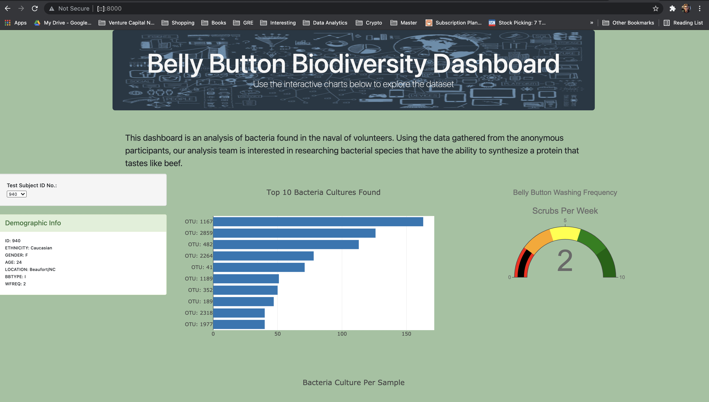

# Plotly & Belly Button Biodiversity

This dashboard is an analysis of bacteria found in the naval of volunteers. Using the data gathered from the anonymous participants, our analysis team is interested in researching bacterial species that have the ability to synthesize a protein that tastes like beef. 

I made this dashboard using JavaScript, Plotly, and D3.js, and visualized the analysis using HTML and CSS. I customized the dashboard by adding a picture to the jumbotron section, adding an introductory paragraph of the purpose of this analysis, and customizing the background of the page as well as the background of each column.

 
**Image 1 : A Screenshot of the HTML**
